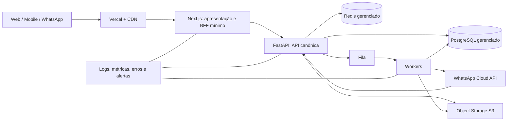

# 01 — Arquitetura Geral

## Objetivo

Separar responsabilidades para que interface, regras de negócio, dados e integrações possam crescer independentemente.

## Estado atual observado

- `apps/web`: Next.js 14/App Router, UI e Route Handlers; concentra autenticação própria, OpenAI, voz, webhook Meta e persistência financeira via serviços/Prisma.
- `apps/api`: FastAPI exposta em `/api/v1`, porém login, usuário e dashboard são estruturais/mock e não são o backend canônico.
- PostgreSQL 16, Redis 7, Traefik, Next.js, FastAPI e Evolution API rodam em Docker Compose na mesma VPS.
- WhatsApp Cloud API chama `apps/web/api/whatsapp/webhook`; Evolution permanece como serviço separado, mas não deve ser dependência do fluxo oficial.

## Arquitetura aprovada proposta

## Responsabilidades

- **Next.js/Vercel:** UX, sessão de interface, SSR, páginas e chamadas autenticadas à API. Não acessa banco diretamente no destino.
- **FastAPI modular monolith:** autenticação, autorização, domínio financeiro, agentes, webhooks e API pública interna.
- **Worker:** recorrências, notificações, geração de relatórios, envio/retry de WhatsApp, processamento de arquivos; nunca no request do usuário.
- **PostgreSQL:** única fonte transacional de dados de produto.
- **Redis/fila:** cache, rate-limit, locks, jobs e idempotência de curta duração; não fonte de verdade.
- **S3:** documentos, comprovantes e mídia; banco guarda somente metadados/URLs assinadas.

## Regras e fluxos

Uma requisição segue `edge → API → serviço de domínio → repositório → banco`; um efeito externo segue `evento/outbox → fila → worker → provedor`. Não criar microserviços por antecipação: começar modular monolith com fronteiras explícitas. Um único contrato de API e uma única ferramenta de migration no banco.

## Relações, boas práticas, riscos e expansão

Financeiro, identidade, agentes e canais são módulos internos com interfaces, não pastas que importam Prisma entre si. Risco atual: dois backends e dois sistemas de migrations (Prisma/Alembic) no mesmo banco criam divergência. Expansão: separar serviços apenas por carga, ownership ou requisito operacional comprovado; não por moda.

