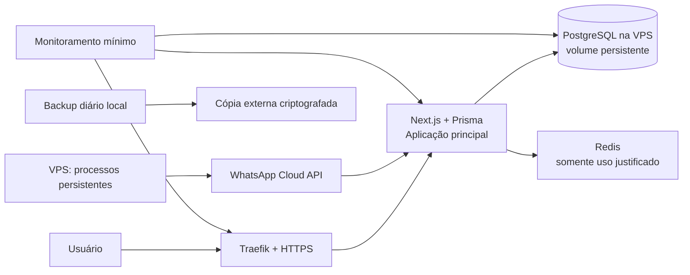

# 19 — Arquitetura de Lançamento

## Objetivo

Lançar o CONTROL FINANCE com segurança suficiente para os primeiros clientes, preservando o núcleo funcional e removendo os riscos que podem causar perda, vazamento ou corrupção de dados.

## Componentes utilizados

| Componente | Responsabilidade no lançamento |
| --- | --- |
| Next.js + Prisma | Aplicação funcional, regras de domínio centralizadas, autenticação e APIs internas. |
| PostgreSQL | Fonte transacional de dados; não exposto publicamente; volume persistente. |
| VPS + Docker Compose | Executar serviços persistentes e integração WhatsApp. |
| Traefik | TLS/HTTPS, roteamento e headers de segurança. |
| Redis | Apenas cache, rate limit ou job quando houver caso real; não contém dado financeiro definitivo. |
| Storage S3 privado | Entra antes de documentos/comprovantes definitivos; não salvar esses arquivos apenas na VPS ou Vercel. |
| Observabilidade mínima | Uptime, erros, CPU, memória, disco, banco, backup e expiração de certificado. |

## P0 — obrigatório antes de clientes reais

1. **Isolamento:** toda consulta e mutação recebe o usuário/workspace autenticado no servidor; validar propriedade em cada registro; testes negativos de acesso cruzado.
2. **Financeiro:** valores em centavos/decimal controlado, transações atômicas, chave de idempotência e reversão auditável; nunca exclusão silenciosa de movimentação relevante.
3. **Identidade:** autenticação e sessão revisadas, proteção de rotas, autorização por papel e rotação de segredos que foram expostos ou manuseados fora de cofre.
4. **Recuperação:** backup diário automático, cópia externa criptografada, retenção definida e restauração completa testada em ambiente isolado.
5. **Operação:** HTTPS válido, logs de erro centralizados ou alertáveis, alertas de indisponibilidade/disco/backup e política única de migrations.
6. **NOVA:** sem acesso direto ao banco; somente ferramentas permitidas, validação de entrada, confirmação para operação financeira sensível e audit trail.
7. **Ambientes:** desenvolvimento/staging/produção separados, segredos separados e deploy revisável.

## P1 — operação profissional

Worker + fila para envio de mensagens, documentos, relatórios, notificações e recorrências; retry limitado e fila de falhas; rate limiting; exportação e exclusão de conta; retenção/LGPD; S3 privado; métricas, alertas e carga inicial.

## P2 — escala

PostgreSQL gerenciado com PITR, réplica e pooler; múltiplas instâncias de API; frontend na Vercel; worker separado; FastAPI como domínio canônico após paridade; observabilidade distribuída e recuperação de desastre mais forte.

## Riscos, limites e avanço

Esta arquitetura é aceitável apenas enquanto métricas estiverem saudáveis e o plano de recuperação for provado. Limites: a VPS segue sendo ponto único de falha; backup externo e teste de restauração reduzem o impacto, mas não substituem banco gerenciado/HA. Avançar para a arquitetura intermediária quando houver saturação sustentada, jobs bloqueando requests, falhas recorrentes, custo desproporcional ou exigência de RPO/RTO menor — conforme critérios do ADR 18.
